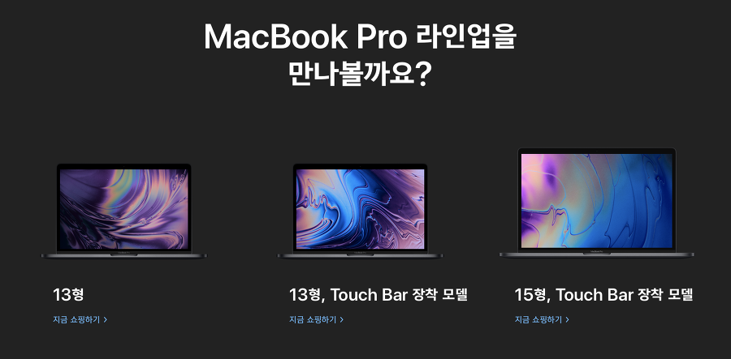
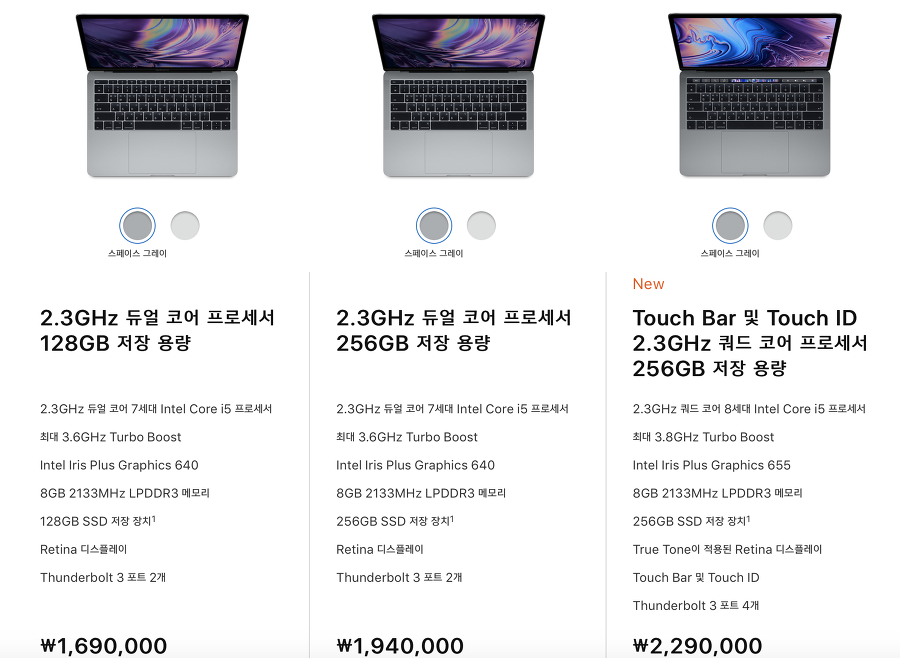
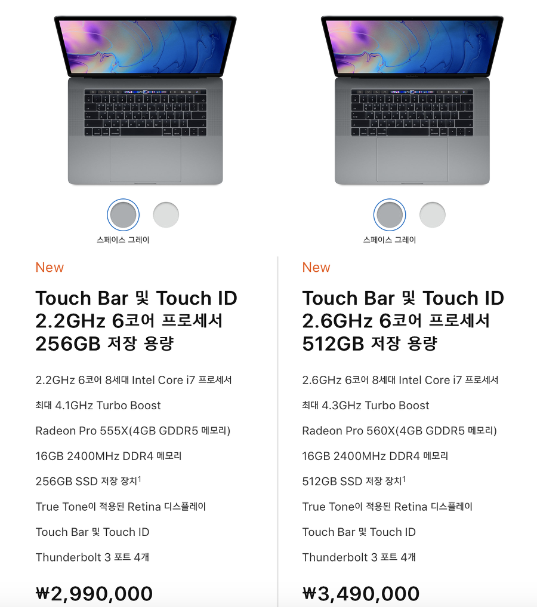
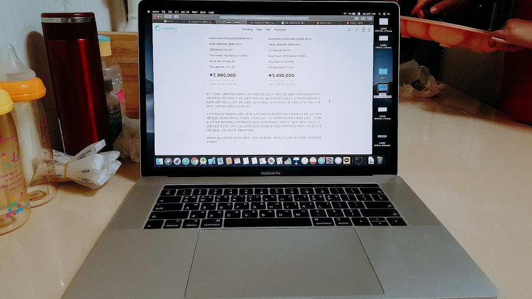
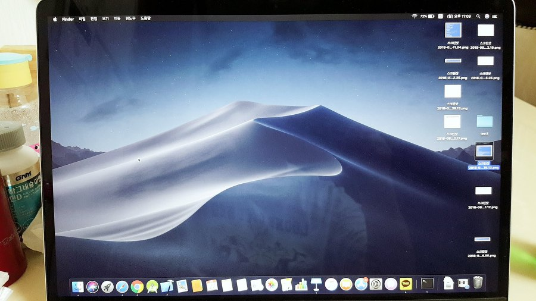
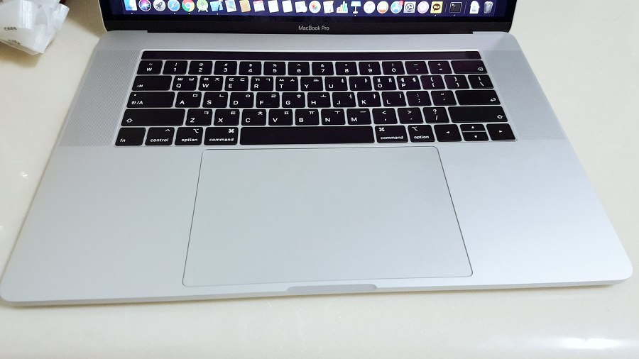
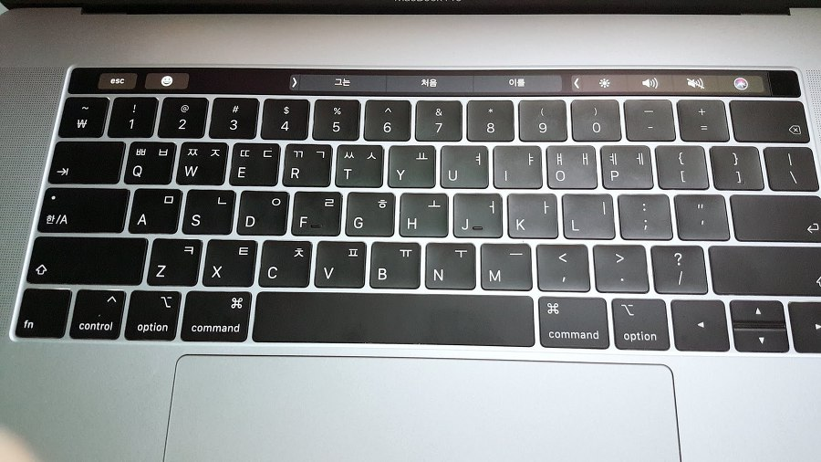
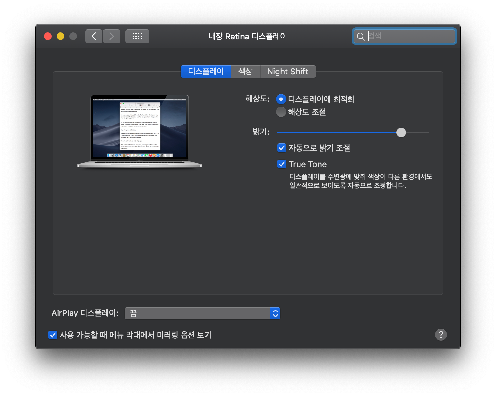

지난달에 맥북 프로 2018 버전 예약 판매를 하길래 서둘러 구입했습니다. 받은 건 일주일정도 된것 같은데요. 매일같이 맥북을 만지는건 아니므로 몇일간의 짧은 사용 후기인 것 같습니다.

<figure class="imageblock alignCenter" width="900" height="444" data-origin-width="900" data-origin-height="443"><figcaption>맥북프로 2018 15인치 맥초보의 후기, 리뷰~!!</figcaption></figure>

### **1\. 개인적인 사전 맥북 사용 경험.**

저의 경우는 맥북프로 2013 버전을 회사에서 간단한 개발 업무용으로 사용하고 있습니다. 주 용도는 안드로이드와 아이폰 앱 개발용도인데요.

이외에 모든 개발은 윈도우를 통해서 하고 있으니 맥은 거의 빌드용이나 다름없습니다. 😊

더군다나 하이브리드 앱 개발의 특성 상 네이티브 개발과 수정은 연간 손에 꼽을만한 일이니 나의 맥북 사용 또한 연간 손에 꼽을 일입니다.

많은 분들이 맥북에서의 개발 환경을 찬양하는 것을 보며 개인적으로 무척이나 궁금했었습니다.

6개월 전에 2017버전으로 지를까 말까 하다가 많은 분들이 2018 버전을 기다렸다가 구매하길 매우 권유했거든요. 그래서 기다렸다가 나오자마자 애플 공식 홈페이지에서 구매하게 되었습니다.

결국 기다린 것은 매우 잘한 결정인것 같습니다. 2017년 버전에 비해서 cpu 코어는 2개가 늘어나 ( 13인치는 2코어에서 4코어로, 15인치는 4코어에서 6코어로 늘어났다.) 비약적인 성능 향상이 있었고, 메모리도 ddr3 타입에서 ddr4로 , 디스플레이에는 트루톤이 적용되었고, 키보드는 버터플라이 2세대에서 3세대로 옆그레이드 된것 같습니다.

* * *

### **2\. 맥북 프로 15인치를 결정하게된 이유**

<figure class="imageblock alignCenter" width="600" height="439" style="width: 600px; height: 439px;" data-origin-width="900" data-origin-height="658"><figcaption>맥북 프로 15인치를 결정하게된 이유</figcaption></figure>

일단 구입 목적은 웹개발과 앱 개발을 조금 할 것이고... ( 할수 있을지 모르겠지만... ). 영화감상 조금 그리고 서핑과 유투브같은걸 주로 하지 않을까 싶거든요.

#### **2.1 눈이 안좋아서 13인치를 사용하기 어려워서 패스.**

제가 눈이 아주 안좋은 관계로 13인치는 패스했습니다. 저는 난시가 심하고 눈이 안좋아서 장시간 컴퓨터 화면을 보면 눈이 지쳐서 화면을 제대로 보지 못하는 증상을 겪는습니다.

회사에서도 동료들은 22인치( 1980\* 1024 )를 사용하는데 반해 저는 일부러 24인치 ( 1680 \* 1024)를 사용할 정도로 눈이 좋지 않습니다. 

조금이라도 화면이 더 커야 눈이 쉬이 지치지 않아 화면은 크고 좀 더 작은 해상도를 이용하는 것인데요. 마찬가지로 맥북도 화면이 작은 13인치를 대상에서 제외해버렸습니다.

다음으로 15인치 구성을 구경해보겠습니다.

<figure class="imageblock alignCenter" width="600" height="677" style="width: 600px; height: 677px;" data-origin-width="900" data-origin-height="1016"><figcaption>맥북프로 2018 15인치</figcaption></figure>

#### **2.2 문제는 32기가 업그레이드 선택여부**

일단 가격대는 100만원정도 올라갑니다. 하지만 화면이 일단 훨씬(?) 커지고 모든 부품의 사양 또한 좋아지기에 가격이 올라가는 것은 이해할 수 있는 요소입니다. 맥북 프로는 옵션으로 사양을 조절할 수 있기에 어떤 옵션으로 사야할지 고민이 되는 요소였고, 일단 고급형 기본을 선택하고 32기가 메모리로 업그레이드를 하느냐 마느냐의 선택의 기로에 매우 고민을 하게 만들었습니다.

32기가 메모리를 이용할만한 유저는 검색을 통해 살펴본다면 멀티미디어 전문가 편집용이나 향후 수년 이후의 개발 환경을 생각해서 미리하는 투자라는 2가지라고 합니다.

저는 멀티미디어는 못하기 때문에 논외고... 두번째로 수년 후의 개발환경이 32기가 메모리를 필요로 하게 된다면이라는 가정인데... 웹이나 앱이나 당분간은 그럴일은 없을 것 같습니다.

그리고 그정도 환경이 필요한 날이 온다면 사양을 전체적으로 업그레이드 하면 된다는 생각에 고급형 - 기본 사양으로 구매하게 되었습니다

회사에서 2013 맥북프로 8기가도 개발과 서핑 용도로는 충분하고도 남음이 있기 때문에 이렇게 결정할 수 있었습니다. 그래도 300만원이 넘는다. ㅠㅠ

저녁에 식탁에서 가지고 노는 중...

<figure class="imageblock alignCenter" width="900" height="506" data-origin-width="900" data-origin-height="506"><figcaption>저녁에 가지고 놀게 된 맥북 프로 2018</figcaption></figure>

* * *

os는 하이시에라로 왔지만 바로 모하비 베타로 설치해줬다.

<figure class="imageblock alignCenter" width="900" height="506" data-origin-width="900" data-origin-height="506"><figcaption>맥북프로 2018 모하비</figcaption></figure>

* * *

실제 색감은 이런 은색이다. 난 실버가 훨씬 좋게 느껴졌다. 스그는 벗겨지기도 하니까... 

<figure class="imageblock alignCenter" width="900" height="506" data-origin-width="900" data-origin-height="506"></figure>

* * *

### **3\. 몇일간의 사용 후기**

#### **3.1 키보드**

  
일단 몇일 간단하게 사용해본 후기로는 가장 인상 깊은 것은 키보드입니다. 2016년부터 사용된거라고 하는데 요번 버전을 3세대라고 하는데요.

2016,2017 버전을 사용해본적이 없기에 비교는 힘들고 회사에서 사용하는 13년 버전과 비교해보자면 이런 누르는 감이 거의 없습니다.

처음에는 맨바닥에 치는 느낌이 나고 몇일 정도 타이핑을 하며 익숙해져도 거의 누르는 느낌이 나지 않는다.

이 느낌을 어떤 사람들은 쫀득 쫀득하다며 칭찬을 하거나 자기 위안을 삼는것 처럼 보이는데 사실 업무, 생활 어떤 환경이든 하나의 키보드로 PC생활을 이어나갈수 없기에 이런 부분은 욕 좀 먹어야 한다고 생각합니다.

아예 18년 형을 샀다가 취소하고 15년 형으로 돌아가는 사람까지 생긴다고 하는데... 말 다 한것이 아닌가 싶습니다.

저같은 경우 회사에서 맥북과 윈도우 pc는 펜타그래프 키보드를 업무용으로 사용해서인지 적응하는데 크게 어려움이 없다. 몇일, 몇달 정도 더 사용하다보면 구름타법(?) 처럼 힘 안들이고 칠수 있을것 같다는 생각이 든다. 아직은 오타가 심심치 않케 난다.

2020.02.16 내용 추가. 현재는 데스크탑을 이용할 때는 콕스 무접점과 레오폴드 저소음적축을 이용합니다. 맥북 프로2018도 계속 타이핑 하다보면 그럭저럭 익숙해지긴 했습니다만... 휴대중에는 어쩔수 없이 이용하지만 집에서 책상에서 사용한다면 키보드를 연결해서 사용해야될 것 같습니다. 

그리고 esc 위치 이것도 적응이 잘 안됩니다. 😭

<figure class="imageblock alignCenter" width="900" height="506" data-origin-width="900" data-origin-height="506"></figure>

esc를 터치바에 두다니... 눌렀는지 안눌렀는지 느낌이 없어서 눈으로 키보드를 보게 되거든요. 그리고 말 나온김에 저 터치바... 이것들도 불편한 것은 마찬가지 이유입니다. 이 터치바에도 터치했을 때 ... 진동이 느껴지도록 했다면 ( 포스터치?) 이렇게까지 혹평받지 않았을 것 같습니다.

* * *

#### **3.2 사운드**

사운드는 막귀인 내가 듣기에도 좋은 소리를 내는것 같습니다. 이 1.8키로 짜리가 내는 소리가 맞는가 싶은데요. 너무너무 좋게 들린다는 소리입니다.  소리가 이상하게 지직 거린다는 이야기를 많이 들었지만 저는 양품을 받은건지 해당 증상은 느끼지 못했습니다.

* * *

#### **3.3 트랙패드**

아! 트랙패드의 크기가 많이 커졌습니다. 뭐... 자꾸 키보드 포인터가 날아간다고 하는데 개인 별 타이핑 습관에 따라 다른것 같습니다.

저는 전혀 불편함없이 치고 있습니다. 개인 별로 타이핑 습관이 다르니 이 부분은 직접 쳐보고 사는것도 나쁘지 않을 것 같습니다.

근데 얼마나 특이하게 치길래 타이핑을 하면서 저 트랙패드를 건드리는 건지... 트랙패드의 터치감이 13버전과는 많이 다릅니다. 실제로 눌리는 방식이 아니라고 하는데요. 포스터치라고 하는데 예전 방식은 손가락의 정전만 인식하는 정전 트랙패드라면 16년부턴가 적용됐던 이 포스터치 방식은 훨씬 나은 사용감을 느끼게 해줍니다.

* * *

#### **3.4 디스플레이**

'오 이게 트루톤인가...?' 트루톤 옵션을 껐다 켰다 해보면서 느꼈던 느낌입니다.

하지만 내 눈으로는 편안하다고 하는데 트루톤이라서가 아니라 그냥 맥북 디스플레이라서 그렇게 느끼는 것 같습니다.

껐다 켰다 해보면 뭔가 블루라이트만 줄어드는... 그러니까 화면이 좀 누래지는 느낌이 들 뿐입니다. 화면은 쨍쨍하니 마음에 듭니다.

난 시력이 아주 나쁜 편이라... 트루톤을 활성화 해놓고 씁니다. 전문 디자이너 같은 분들은 색상 보정이 있으면 안되기에 꺼놓고 쓰라고들 합니다...

그러니까 내가 평가하기에는 그동안 썼던 디스플레이가 너무 구려서 이게 너무 좋게만 느껴진다는 검다...

* * *

### **4\. 그냥 후기.**

드디어 기나긴 윈도우만 사용하다 맥 os를 데스크탑 대신 이용하려고 구매하게 되었습니다. 여기저기 주변에서 찬양하는 걸 많이 듣고 보다보니 그렇게 된것 같습니다.

저 스스로도 맥의 스마트한 개발환경도 느껴보고 싶었고 ios 개발도 겸사겸사 하기 위해서 샀는데 아직 시작도 안했는데 만족감은 큰 것 같습니다. 꽤나 심한 단점이 하나 있는 거 같긴한데 뭔가 악세서리 등 추가 비용이 많이 든다는 것이죠. ㅠㅠ

벌써 가방, 멀티 허브, 거치대 등 사야 할 것들이 널려있으니 빚이 나날이 늘어날 예정입니다.

성능은 잘 모르겠습니다. 내가 사용하는 수준 내에서 벽에 부딪칠 일이 있을지 모르겠거든요. 끽해봐야 xcode, android studio 같은게 제일 무거운 툴이 될것 같은데 얘네들은 2013에서도 충분히 잘 돌아가는 애들입니다. 지금 수일간 했던 유투브, 서핑, 문서작성 등에서는 쾌적합니다. (당연한 소릴... )

결론. 맥북을 입양하게 되니 감회가... 이런 감동이... 쓰나미처럼 밀려오며 자꾸 자꾸 써줘야겠다는 다짐을 하게 됩니다... 암 그럼 가격이 얼만데 ㅜㅜ.

<figure class="imageblock alignCenter" width="148" height="296" data-origin-width="150" data-origin-height="300"></figure>

파트너스 활동을 통해 일정액의 수수료를 제공받을 수 있음
